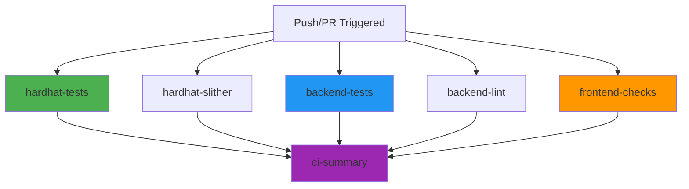

# GitHub Actions CI/CD Workflows

This directory contains automated workflows for continuous integration and deployment.

## Available Workflows

### 1. `ci.yml` - Comprehensive Testing & Analysis (NEW)

**Runs on**: Push to `main` or `develop`, and all pull requests

**Jobs**:
- ✅ **Hardhat Smart Contracts**
  - Compile contracts
  - Run tests (Mocha + Chai)
  - Generate coverage report
  - Run Slither security analysis

- ✅ **Go Backend**
  - Run unit tests
  - Run integration tests (with PostgreSQL)
  - Generate coverage report
  - Run golangci-lint
  - Check code formatting (gofmt)

- ✅ **Next.js Frontend**
  - TypeScript type checking
  - ESLint linting
  - Production build verification

**Parallelization**: All jobs run in parallel for fast feedback (~3-5 minutes total)

**Artifacts**: Coverage reports and build artifacts saved for 7 days

---

### 2. `slither.yml` - Slither Security Analysis (LEGACY)

**Status**: Deprecated - now part of `ci.yml`

**Recommendation**: You can safely delete this file as Slither is now integrated into the main CI workflow.

---

## Workflow Details

### Job Dependency Graph



### Environment Requirements

#### Secrets Required
- `NEXT_PUBLIC_WALLETCONNECT_PROJECT_ID` (optional for frontend build)
  - If not set, uses dummy value for CI builds
  - Required for production deployments

#### Services
- **PostgreSQL 15**: Automatically started for backend integration tests
  - Host: localhost:5432
  - Database: token_vesting_test
  - User/Password: postgres/postgres

### Performance Optimization

1. **Caching**:
   - Node.js dependencies cached (hardhat + frontend)
   - Go modules cached (backend)

2. **Concurrency**:
   - Previous runs cancelled on new pushes
   - All jobs run in parallel

3. **Failure Handling**:
   - Coverage failures don't block deployment
   - Linting warnings don't fail builds
   - Slither warnings logged but don't block

---

## Local Testing

Before pushing, test locally:

### Hardhat
```bash
npm test                 # Run tests
npm run coverage         # Coverage report
```

### Backend
```bash
cd backend
make test               # All tests
make test -v            # Verbose
make lint               # Linting
make fmt                # Format code
```

### Frontend
```bash
cd frontend
npm run lint            # ESLint
npx tsc --noEmit        # TypeScript check
npm run build           # Production build
```

---

## Troubleshooting

### Common Issues

#### 1. **Backend tests failing in CI but passing locally**
- Ensure PostgreSQL service is running in CI (check `backend-tests` job)
- Verify DATABASE_URL environment variable is set correctly

#### 2. **Frontend build failing with "Missing environment variables"**
- Add `NEXT_PUBLIC_WALLETCONNECT_PROJECT_ID` to repository secrets
- Or use dummy values for CI (already configured)

#### 3. **golangci-lint timeout**
- Increase timeout in workflow (currently 5m)
- Or disable specific slow linters

#### 4. **Slither false positives**
- Add `slither.config.json` to exclude specific warnings
- Or adjust `slither-args` in workflow

---

## Adding New Checks

### Example: Add Prettier formatting check

```yaml
- name: Check Prettier formatting
  working-directory: ./frontend
  run: npx prettier --check "**/*.{ts,tsx,js,jsx,json,css}"
```

### Example: Add Go security scanning with gosec

```yaml
- name: Run gosec security scanner
  uses: securego/gosec@master
  with:
    args: '-no-fail -fmt sarif -out results.sarif ./...'
```

---

## Workflow Status Badges

Add to your README.md:

```markdown

```

---

## Migration from Old Workflow

Previously included `slither.yml`:

1. ✅ New `ci.yml` includes Slither analysis
2. ✅ Delete `slither.yml` to avoid duplication
3. ✅ Update README badges to point to `ci.yml`

---

## Performance Metrics

**Estimated Run Times** (on GitHub-hosted runners):

| Job | Estimated Time |
|-----|----------------|
| hardhat-tests | ~2-3 minutes |
| hardhat-slither | ~1-2 minutes |
| backend-tests | ~3-4 minutes |
| backend-lint | ~1 minute |
| frontend-checks | ~2-3 minutes |
| **Total (parallel)** | **~4-5 minutes** |

**Cost**: Free on public repositories (unlimited minutes)

---

## Maintenance

**Recommended Updates**:
- Update Node.js version when LTS changes (currently 18)
- Update Go version when new releases occur (currently 1.24)
- Update action versions quarterly (e.g., `actions/checkout@v5`)
- Review and update golangci-lint version monthly

**Last Updated**: 2025-10-20
